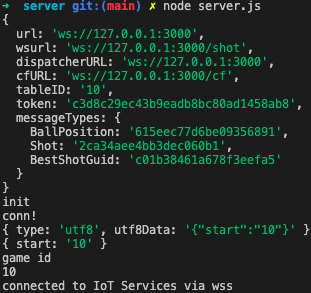

# SmartKickers

## Overview

SmartKickers is a project to make your kickers more immersive. It uses Ximea camera to track the ball.

The following repository contains:

- Golang server for processing the data.
- React client to display game information.

## Table of content

- [SmartKickers](#smartkickers)
  - [Overview](#overview)
  - [Table of content](#table-of-content)
  - [Features](#features)
  - [Prerequisites](#prerequisites)
  - [Installation](#installation)
  - [Launching](#launching)
    - [Launching the server and web application](#launching-the-server-and-web-application)
    - [Launching the ball-tracking software](#launching-the-ball-tracking-software)

## Features

- Keeping track of the score.
- Manually adjust the score.

## Prerequisites

Install the following:

1. [Git](https://git-scm.com/downloads)
2. [Python](https://www.python.org/downloads/) in version 3.10.5 or higher
3. [Node](https://nodejs.org/en/download/) in version 16.16.0 or higher
4. Access to [SmartKickersAI](https://github.com/HackYourCareer/SmartKickersAI)

   **NOTE:** To get access for SmartKickersAI repository contact someone from [Team Beavers](https://wiki.one.int.sap/wiki/display/saplabspoland/Beavers+Team) on slack or via email.

5. [Ximea camera drivers](https://www.ximea.com/support/wiki/apis/)
6. Docker API for example Docker Desktop:
   - [MacOS](https://docs.docker.com/desktop/install/mac-install/)
   - [Windows](https://docs.docker.com/desktop/install/windows-install/)
   - [Linux](https://docs.docker.com/desktop/install/linux-install/)
7. Numpy

   ```bash
   pip3 install numpy
   ```

   For **brew** users:

   ```bash
   brew install numpy
   ```

8. OpenCV-python

   ```bash
   pip3 install opencv-python
   ```

   For **brew** users:

   ```bash
   brew install opencv
   ```

9. Imutils

```bash
pip3 install imutils
```

## Installation

1. Make a new directory and open it in command line terminal.

   ```bash
   mkdir smartkickers
   cd smartkickers
   ```

2. Clone the repository.

   ```bash
   git clone https://github.com/HackYourCareer/SmartKickersAI.git
   ```

3. Check if you have installed all of the [prerequisites](https://github.com/HackYourCareer/SmartKickers#prerequisites).

   **MacOS** users can run the [`requirementsCheck.sh`](requirementsCheck.sh) script to check if they have any missing dependencies.

   **NOTE:** The script will look for open-cv, numpy, imutils, ximer driver **only after successfully installing python!** So if you don't have python it won't print missing python dependent packages except python itself.

   ```bash
   cd SmartKickers
   sudo ./requirementsCheck.sh
   ```

   **Windows** users have to check the dependencies manually.

4. Install missing dependencies. The links can be found in [prerequisites section.](https://github.com/HackYourCareer/SmartKickers#prerequisites)

5. Pull frontend image from GCR

```bash
docker pull ghcr.io/hackyourcareer/smartkickers-frontend:latest
```

6. Pull backend image from GCR

```bash
docker pull ghcr.io/hackyourcareer/smartkickers-backend:latest
```

## Launching

> **NOTE:** Configuration files for the camera view are provided by the developers in [`SmartKickersAI`](https://github.com/HackYourCareer/SmartKickersAI/tree/main/LocalServer) repository.

### Launching the server and web application

- Run pulled containers

  - In terminal run:

  ```bash
  docker run -p 3000:3000 ghcr.io/hackyourcareer/smartkickers-backend:latest
  ```

  - In the new terminal run:

  ```bash
  docker run -p 3007:80 ghcr.io/hackyourcareer/smartkickers-frontend:latest
  ```

### Launching the ball-tracking software

- Plug-in the camera wire to the computer.

- In new terminal switch to [`SmartKickersAI/LocalServer/server`](SmartKickersAI/LocalServer/server) and launch the node server.

  ```bash
  cd SmartKickersAI/LocalServer/server
  node server.js
  ```

  You will see the following output indicating that we have successfully connected to the go server.

  

- In the browser, go to [`localhost:3007`](http://localhost:3007/) to see the react application.

  Properly working React application looks like this.

  
