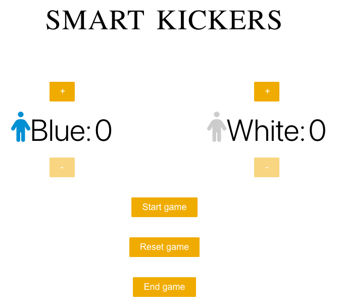

# SmartKickers

## Overview

SmartKickers is a project to make your kickers more immersive. It uses Ximea camera to track the ball.

The following repository contains:

- Golang server for processing the data.
- React client to display game information.

## Table of contents

- [SmartKickers](#smartkickers)
  - [Overview](#overview)
  - [Table of contents](#table-of-contents)
  - [Features](#features)
  - [Prerequisites](#prerequisites)
  - [Installation](#installation)
  - [Launching](#launching)
    - [Launching the server and web application](#launching-the-server-and-web-application)
    - [Launching the ball-tracking software](#launching-the-ball-tracking-software)
  - [Contact Information](#contact-information)

## Features

- Keeping track of the score
- Manually adjusting the score

## Prerequisites

Get the following:

1. [Git](https://git-scm.com/downloads)
2. [Python](https://www.python.org/downloads/) in version 3.10.5 or higher
3. [Node.js](https://nodejs.org/en/download/) in version 16.16.0 or higher
4. Access to [SmartKickersAI](https://github.com/HackYourCareer/SmartKickersAI)

   > **NOTE:** To get access to the SmartKickersAI repository, [contact](#contact-information) Team Beavers.

5. [Ximea camera drivers](https://www.ximea.com/support/wiki/apis/)
6. Docker daemon for example Docker Desktop:
   - [MacOS](https://docs.docker.com/desktop/install/mac-install/)
   - [Windows](https://docs.docker.com/desktop/install/windows-install/)
   - [Linux](https://docs.docker.com/desktop/install/linux-install/)
7. [NumPy](https://numpy.org/install/)

> **TIP:** If you're a macOS user, you can also use `brew` to install NumPy:

```bash
brew install numpy
```

8. [OpenCV-Python](https://pypi.org/project/opencv-python/)

9. [Imutils](https://pypi.org/project/imutils/)

Check if you have installed all of the [prerequisites](https://github.com/HackYourCareer/SmartKickers#prerequisites).

> **TIP:** If you're a macOS user, you can run the [`requirementsCheck.sh`](requirementsCheck.sh) script to check for any missing dependencies. Note that the script looks for OpenCV, NumPy, Imutils, and the Ximea driver **only after you have successfully installed Python!** If you don't have Python, it doesn't print missing Python-dependent packages except Python itself.

```bash
sudo ./requirementsCheck.sh
```

## Installation

1. Create a new directory and navigate to it in a terminal.

```bash
mkdir smartkickers
cd smartkickers
```

2. Clone the repository.

```bash
git clone https://github.com/HackYourCareer/SmartKickersAI.git
```

3. Pull frontend image from GCR

```bash
docker pull ghcr.io/hackyourcareer/smartkickers-frontend:latest
```

4. Pull backend image from GCR

```bash
docker pull ghcr.io/hackyourcareer/smartkickers-backend:latest
```

## Launching

> **NOTE:** Configuration files for the camera view are provided by the developers in the [`SmartKickersAI`](https://github.com/HackYourCareer/SmartKickersAI/tree/main/LocalServer) repository.

### Launching the server and web application

- Run pulled containers

  - In a terminal run:

  ```bash
  docker run -p 3000:3000 ghcr.io/hackyourcareer/smartkickers-backend:latest
  ```

  - Open a new terminal and run:

  ```bash
  docker run -p 3007:80 ghcr.io/hackyourcareer/smartkickers-frontend:latest
  ```

### Launching the ball-tracking software

1. Plug in the camera to the computer.

2. In order to launch the application, navigate to the `SmartKickersAI` repo and double click `start` file.

   Successful connection to the Go server shows the connection details like in the screenshot below:

   

3. In your Internet browser, go to [`localhost:3007`](http://localhost:3007/) to see the React application.

This takes you to the SmartKickers React application.



## Contact Information

Team Beavers members:

- [Piotr Kołodziejski](https://github.com/Pichi00) - piotr.kolodziejski@sap.com
- [Marek Kawalski](https://github.com/marekkawalski) - marek.kawalski@sap.com
- [Michał Kalke](https://github.com/MichalKalke) - michal.kalke@sap.com
- [Kacper Małachowski](https://github.com/KacperMalachowski) - kacper.malachowski@sap.com
- [Marek Michali](https://github.com/MarekMichali) - marek.michali@sap.com
- [Filip Gołyszny](https://github.com/Filip22022) - filip.golyszny@sap.com
